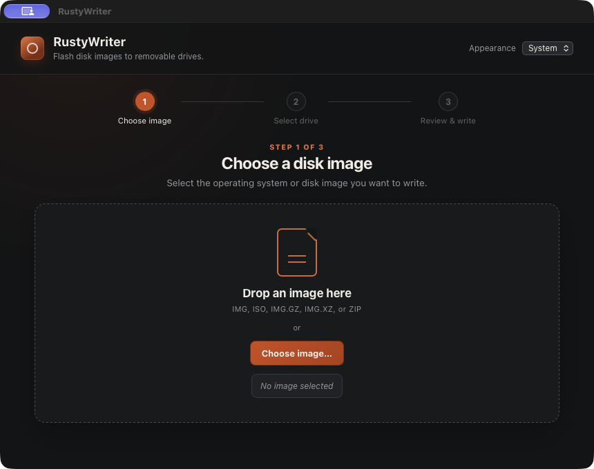
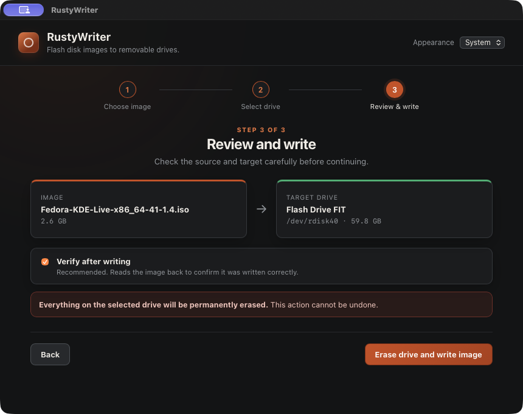

# RustyWriter

[](https://github.com/KwisatzJim/RustyWriter/actions/workflows/ci.yml)

A minimal, fast, cross-platform disk-imaging tool — the same job as
balenaEtcher, written in Rust with a Tauri GUI. RustyWriter supports
macOS and Linux.

### Choose an image



### Review before writing




## Architecture

The interesting design problem in a tool like this is: writing to a
raw block device needs root/admin, but you really don't want your
whole GUI (webview, JS engine, network stack) running elevated.
Etcher solves this by shelling out to a privileged child process for
the actual write, and RustyWriter does the same:

```
┌─────────────────────────┐   1. stages image to /tmp          ┌───────────────────────────┐
│   rustywriter (Tauri)   │      (decompress if needed)         │                            │
│   runs unprivileged     │                                     │                            │
│                          │   2. pkexec / osascript ──────────▶│   rustywriter-helper       │
│  - lists removable      │                                     │   runs as root, briefly    │
│    drives (read-only,   │                                     │                            │
│    no privilege needed) │◀──── tails a progress file ────────│  - unmounts the device     │
│  - file picker           │                                    │  - writes the staged file  │
│  - decompresses/stages   │                                    │    to the device           │
│    the picked image      │                                    │  - re-reads + hashes to    │
│  - renders progress      │                                    │    verify (optional)       │
└─────────────────────────┘                                     └───────────────────────────┘
```

**Why staging happens in the unprivileged app, not the helper:** macOS
gates read access to Desktop/Documents/Downloads/iCloud Drive/network
volumes behind a permission system keyed to the *executable*, not the
user ID — running as root doesn't bypass it. The native file-picker
dialog grants a one-time read exception to whichever process shows
it (the Tauri app), not to some other process launched moments later.
So the app reads and decompresses the picked image itself — wherever
it lives — into a plain scratch file under the system temp dir (never
one of the protected folders), and only hands the privileged helper
that already-local path. This also shrinks what runs elevated down to
"copy a file to a device and verify," which is a nice side benefit
independent of the permissions issue: less code running as root is
just good practice.

**Why a file for progress, not stdout:** on macOS the helper is
launched through AppleScript's administrator-privileges flow, which
buffers the child's output until it exits. That makes a live progress
bar over stdout impossible. Instead the app safely creates a uniquely
named progress file, the helper appends newline-delimited JSON, and
the app follows it like `tail -f`. The app owns and removes this file
after success, failure, or cancellation. This works identically on
Linux (`pkexec`) and macOS.

**Image pipeline:** format is sniffed from magic bytes, not the file
extension (a renamed file shouldn't corrupt a flash). Gzip, xz, and
raw images are streamed straight through a decompressor into the
staging file in 4 MiB chunks. Zip is handled the same way, using the
exact uncompressed size the zip central directory records for that
entry.

**Verification:** a SHA-256 hash is computed over the staged file
while it's being written to the device (free — no extra pass).
After writing, the helper re-reads exactly that many bytes back off
the device, hashes them, and compares digests.

**Safety:** on macOS, internal and virtual disk-image devices are
excluded. On Linux, removable media and USB-attached storage are
eligible, but the physical disk backing the running root filesystem
is excluded, including roots layered through device-mapper. The
backend re-enumerates the target immediately before elevation, checks
that the decompressed image is nonempty and fits, and refuses to write
unless every target filesystem is confirmed unmounted. The GUI also
requires explicit confirmation naming the exact drive and size.

## Project layout

```
RustyWriter/
├── helper/            # privileged CLI worker (rustywriter-helper)
│                       # only ever touches: a staged plain file, the
│                       # device, progress file, and cancellation signal
├── src-tauri/          # the Tauri app (unprivileged)
│   ├── src/
│   │   ├── main.rs        # commands and managed flash/cancel state
│   │   ├── devices.rs     # removable-drive enumeration (macOS/Linux)
│   │   ├── image_source.rs # sniffs format, decompresses/stages the
│   │   │                    # picked image into a plain temp file
│   │   └── flash.rs       # stages the image, spawns the helper
│   │                        # elevated, tails its progress
│   ├── tauri.conf.json
│   └── capabilities/
├── ui/                 # plain HTML/CSS/JS frontend (no npm needed)
└── scripts/
    ├── prepare-sidecar.sh
    ├── build-macos-release.sh
    └── build-linux-release.sh
```

## Building

You'll need:
- A current Rust toolchain (`rustup` recommended)
- The [Tauri CLI](https://tauri.app): `cargo install tauri-cli --version "^2"`
- Tauri's usual system prerequisites for your OS (WebKitGTK + friends
  on Linux, Xcode command line tools on macOS) — see
  https://v2.tauri.app/start/prerequisites/

There's no npm/node step — the frontend is plain HTML/CSS/JS served
directly, so `frontendDist` in `tauri.conf.json` just points at `ui/`.

### Dev

```bash
cargo build -p rustywriter-helper   # build the helper once
cargo tauri dev
```

In dev mode, `flash.rs` finds `rustywriter-helper` sitting next to the
main binary in the shared workspace `target/` directory automatically
— no extra setup needed.

### Release builds

Packaged apps need the helper bundled as a Tauri "sidecar", which
requires it to be named with the host's target-triple suffix
(`rustywriter-helper-aarch64-apple-darwin`, etc). The platform build
scripts compile and stage that helper before invoking Tauri.

On macOS:

```bash
./scripts/build-macos-release.sh
```

This produces the macOS application bundle and DMG for the current
Mac's architecture.

On Linux:

```bash
./scripts/build-linux-release.sh
```

On Arch-family distros (CachyOS, Arch,
EndeavourOS, etc), `cargo tauri build`'s AppImage step fails with
`failed to run linuxdeploy` because the system `strip` (from newer
binutils) produces ELF sections linuxdeploy's own bundled `strip`
doesn't recognize - this is an upstream linuxdeploy/binutils gap, not
a RustyWriter bug, and the standard workaround is building with
`NO_STRIP=true`. The Linux script includes that automatically.

If it still fails after that, it's usually FUSE - AppImages need it
to mount themselves at bundle time:

```bash
sudo pacman -S fuse2      # Arch/CachyOS
sudo apt install fuse     # Debian/Ubuntu/Pop!_OS
```

## macOS: Full Disk Access is required, and it's not optional

Writing to a raw whole-disk device (`/dev/rdiskN`) has required an
explicit, user-granted **Full Disk Access** permission since macOS
Catalina — deliberately, to stop a compromised or malicious root
process from silently wiping disks. **Running as root does not
bypass this.** There's no way to code around it; the person running
RustyWriter has to grant it once, manually:

1. **System Settings → Privacy & Security → Full Disk Access**
2. Click **+**, press **Cmd+Shift+G**, and enter the path to the
   helper binary - in a dev build that's:
   ```
   <project>/target/debug/rustywriter-helper
   ```
   (a packaged app's helper lives at whatever path
   `scripts/prepare-sidecar.sh` staged it to)
3. Toggle it on, then try flashing again.

This grant is tied to the binary's code signature. An unsigned or
ad-hoc-signed development build can have the grant invalidated by a
rebuild, requiring you to add it again. A release signed with a stable
Developer ID identity keeps the permission across updates. If raw
access is denied, RustyWriter reports the exact Full Disk Access steps
in its error message.

## Safety features

- **Large-drive warning**: any removable drive at or above 128 GB
  (the same rough heuristic balenaEtcher uses) gets a visible "Large"
  badge in the drive list, plus an extra warning banner and a
  required confirmation checkbox in the erase dialog before the
  "Yes, erase and write" button becomes clickable. The idea is to
  catch the specific mistake of an accidentally-listed external SSD
  or secondary data drive getting selected instead of a small flash
  drive - not to slow down normal USB stick flashing.
- **Drag-and-drop**: dropping an image file anywhere in the window
  selects it, same as the file picker. This uses Tauri's native
  webview drag-drop event API (`getCurrentWebview().onDragDropEvent`)
  rather than plain HTML5 `ondrop`, because `dragDropEnabled` in
  `tauri.conf.json` makes the webview intercept OS file drops before
  they'd ever reach a DOM drop event.
- **Target revalidation**: the frontend sends a device identifier, not
  a writable path. The Rust backend rebuilds its removable-drive
  allow-list after staging and uses the freshly discovered path.
- **Capacity and free-space checks**: staging stops before the
  decompressed image can exceed the selected drive or consume the
  final 256 MiB of temporary-disk space.
- **Fail-closed unmounting**: the helper independently confirms that
  no target filesystem remains mounted before opening the device.
- **Verification**: optional SHA-256 verification re-reads exactly the
  bytes written and compares them with the source hash.
- **Cancellation**: staging, writing, and verification can be
  cancelled. Cancelling after writing begins clearly warns that the
  target may contain a partial image.
- **Safe ZIP selection**: a single-file archive is accepted directly;
  a multi-file archive must contain exactly one unambiguous `.img`,
  `.iso`, or `.raw` entry.
- **Webview hardening**: device metadata is rendered as text, a
  restrictive Content Security Policy is enabled, and the webview has
  no shell permission.

## User interface

- Native file picker and drag-and-drop image selection
- Live staging, writing, and verification progress
- Actionable errors and post-write eject warnings
- Keyboard and screen-reader support
- Light, Dark, and System appearance modes, with the preference saved
  across launches

## Current limitations

- **Progress percentage while staging gzip/xz images**: the
  decompressed size isn't known ahead of time for streaming gzip/xz,
  so the staging bar falls back to showing bytes processed instead of
  a percentage until it's done. Once staging finishes, the actual
  write-to-device progress always shows a true percentage, since the
  staged file's exact size is known by then. Zip images show a true
  percentage throughout, since the zip central directory records the
  exact uncompressed size up front.
- **Staging needs free disk space** equal to the image's decompressed
  size in the OS temp directory (typically `/tmp`). RustyWriter checks
  space while staging and preserves a 256 MiB system reserve, but the
  complete decompressed image still has to fit there.
- **Windows isn't implemented yet.** The helper's device-write and
  hashing logic is portable, but `devices.rs` (drive enumeration) and
  `platform.rs` (unmount/eject) both need Windows-specific
  implementations (`IOCTL_DISK_GET_DRIVE_GEOMETRY` /
  `IOCTL_VOLUME_*` for enumeration, `DeviceIoControl` with
  `FSCTL_LOCK_VOLUME` for exclusive access, and elevation via a UAC
  prompt instead of pkexec/osascript).

## Validation

- The workspace test suite and strict Clippy checks pass on macOS.
- A complete write, SHA-256 verification, and eject cycle has been
  successfully tested with disposable media on macOS.
- The application has been built and run successfully on Linux.
- GitHub Actions is configured to run the locked test suite and strict
  Clippy checks on both macOS 15 and Ubuntu 24.04 for pushes and pull
  requests.
